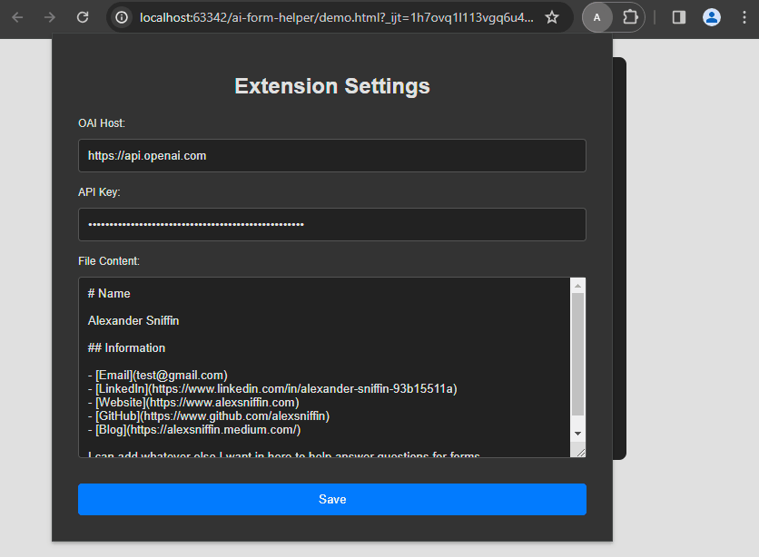

# AI Form Helper

AI Form Helper is a Chrome extension designed to enhance web form interaction by automatically filling form fields with intelligent suggestions from a provided document.

## Features

- **Automatic Form Field Detection**: Detects active form fields and identifies the context of the information required.
- **Intelligent Suggestions**: Utilizes LLMs to generate context-aware suggestions for form fields based on the content of the webpage and predefined user data.
- **Customizable Settings**: Offers a popup interface for users to customize settings such as API keys, server host, and predefined content templates.
- **Local OAI**: Compatible with both OAI API and local OAI servers.

## Installation

To install AI Form Helper:

1. Clone this repository or download the ZIP file.
2. Unzip (if downloaded as ZIP) and navigate to `chrome://extensions/` in your Chrome browser.
3. Enable "Developer mode" in the top right corner of the page.
4. Click "Load unpacked" and select the folder containing the extension files.
5. The AI Form Helper icon should now appear in your browser toolbar, ready for use.

## Usage

1. **Setting Up**: Click on the AI Form Helper icon and use the popup to configure your OAI host, API key, and default content.
2. **Filling Forms**: Navigate to a web form and click the desired input field. Press the assigned hotkey "`" to trigger the AI suggestion.
3. **Customization**: Reopen the popup at any time to adjust your settings or update your predefined content.

## Configuration

To customize AI Form Helper:

- **OAI Host**: The host address of OAI API.
- **API Key**: Your OAI API key.
- **File Content**: Predefined content or templates that the AI can use to generate suggestions.
